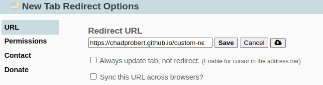
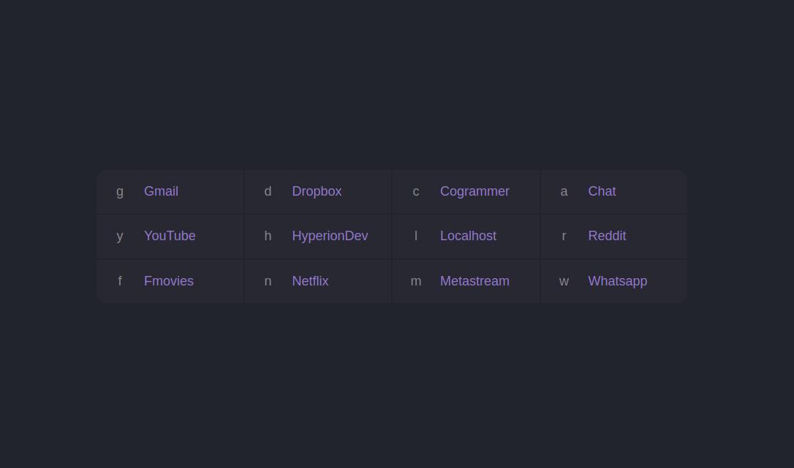

<a name="readme-top"></a>

<!-- PROJECT LOGO -->
<div align="center">
    

  ### Custom New Tab

  <p>
    For those who love keyboard shortcuts and minimalism.
    <br />
    <br />
    <a href="https://chadprobert.github.io/custom-new-tab/">View Demo</a>
    ·
    <a href="https://github.com/ChadProbert/new-page-app/issues">Report Bug</a>
    ·
    <a href="https://github.com/ChadProbert/new-page-app/pulls">Request Feature</a>
  </p>

  <!-- SHIELDS.IO -->
  
  
  
  
  

  #### Built With

  
  
  

</div>

<!-- TABLE OF CONTENTS -->
<details>
  <summary>Table of Contents</summary>
  <ol>
    <li><a href="#about-the-app">About The App</a></li>
    <li>
      <a href="#getting-started">Getting Started</a>
      <ul>
        <li><a href="#prerequisites">Prerequisites</a></li>
        <li><a href="#installation">Installation</a></li>
        <li><a href="#setup">Setup</a></li>
      </ul>
    </li>
    <li><a href="#usage">Usage</a></li>
    <li><a href="#modifying-the-app">Modifying The App</a></li>
  </ol>
</details>

## About The App
This is a custom new tab page that allows you to quickly navigate to your favourite sites using keyboard shortcuts. It is designed to be minimalistic and easy to use. The app can be set as the default new tab page by using the `New Tab Redirect` Chrome extension.

## Getting Started

To get a local copy up and running follow these steps.

### Prerequisites
- [New Tab Redirect Chrome Extension](https://chromewebstore.google.com/detail/new-tab-redirect/icpgjfneehieebagbmdbhnlpiopdcmna)

### Installation

```sh
git clone https://github.com/ChadProbert/new-page-app.git
```

### Setup

1. Open the New Tab Redirect extension options
2. Set the redirect URL to the path of the deployed app URL <br />
3. Save the changes


## Usage



To go to a site, type the corresponding key and press enter. e.g:

- `g` will redirect you to [gmail.com](https://gmail.com)

To search a site, type a space after the site's key followed by your
query. e.g:

- `y introduction to python` will
  [search YouTube for introduction to python videos](https://www.youtube.com/results?search_query=introduction+to+python)

A google search will be triggered if your input doesn't match a key.
e.g:

- `hello world python` will [search Google for hello world python](https://www.google.com/search?q=hello%20world%20python)

To go to a specific path on a site, type the path after the site's key.
e.g:

- `r/r/startpages` will redirect you to
  [reddit.com/r/startpages](https://www.reddit.com/r/startpages)
  
## Modifying The App

You can modify the shortcut keys and URLs by editing the `COMMANDS` variable inside the index.html file.

If you choose to modify the app, you will need to deploy the modified version and set the redirect URL to your own deployed app URL.
<br />
<br />
<br />
<p align="center"><a href="#readme-top">(back to top)</a></p>
